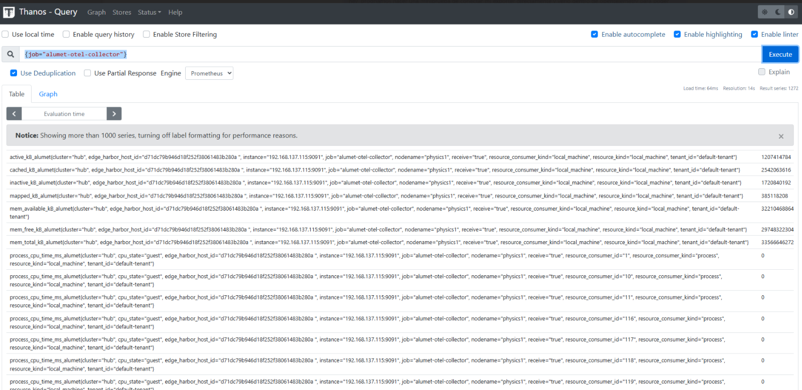

# Opentelemetry plugin

This crate is a library that defines the Opentelemetry plugin.

Implements a push-based OTPL receiver which can be connected to an Opentelemetry Collector, processed in any way, and then exported to a observability backend like Jaeger, Prometheus, Thanos, OpenSearch, ElasticSearch.

## Demos

The plugin has been tested on a NUC with the default configuration.

### Opentelemetry demo

The connection to the Opentelemetry Collector was done following the [official tutorial](https://github.com/open-telemetry/opentelemetry-rust/tree/main/opentelemetry-otlp/examples/basic-otlp-http).

For the demo, the "stress --cpu 8 --io 4 --vm 2 --vm-bytes 128M" command was used to ensure that data was pulled correctly.

## Next
